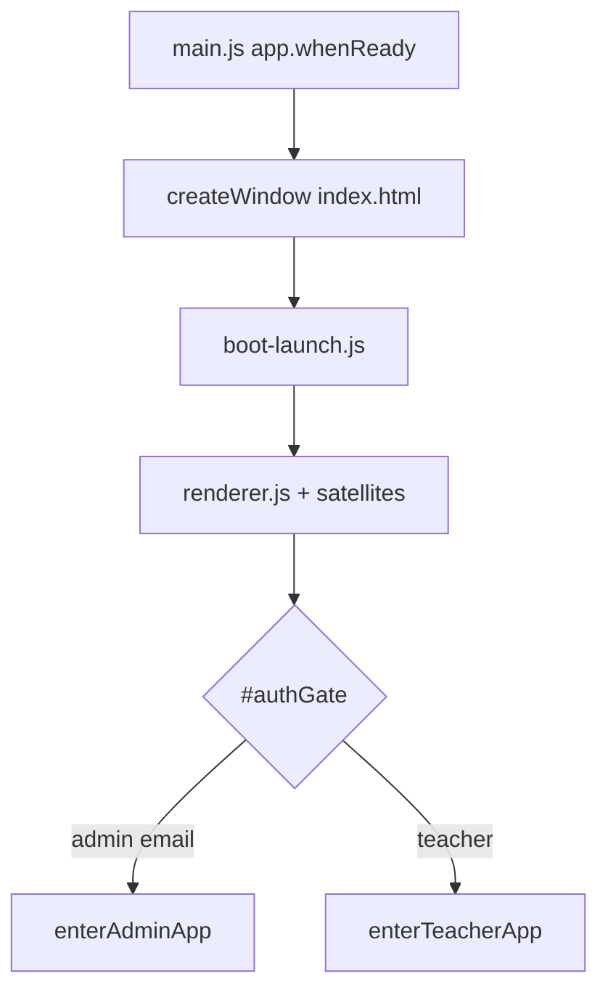
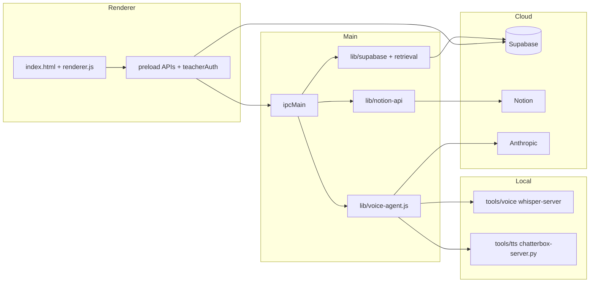

# Codebase navigation — Recruit My English (Teachers Portal)

Electron desktop app: Notion payslips, Supabase auth/data, admin + teacher portals, planner/vault, calendar, voice agent (Whisper → Claude → Chatterbox).

**Related:** [AGENTS.md](./AGENTS.md) · [.cursor/rules/codebase-map.mdc](./.cursor/rules/codebase-map.mdc) (pinned rule — auto-included every chat) · [.cursor/skills/rme-two-portals/SKILL.md](./.cursor/skills/rme-two-portals/SKILL.md)

**Maintenance:** Refresh ~2 weeks or when IPC/sidecars change. Sync **NAVIGATION.md** + **codebase-map.mdc** + line anchors (`wc -l`).

**Line counts:** `wc -l` via Git Bash, 2026-05-24 (every line, including blanks).

---

## Start here

| Goal | Open first |
|------|------------|
| New IPC or sidecar | `main.js` → `preload.js` |
| UI / admin vs teacher | `renderer.js` + `rme-two-portals` skill |
| Voice / TTS | `lib/voice-agent.js`, `lib/tts/`, voice IPC in `main.js` ~2851 |
| Notion payslips | `lib/notion-api.js`, notion IPC in `main.js` |
| DB schema | `supabase/migrations/` (001–019) |
| Packaged build | `package.json` `build`, `scripts/bake-supabase-public-env.cjs` |

---

## Boot flow



**Script load order** (`boot-launch.js`):  
`renderer-idle-power.js` → `renderer.js` → `renderer-calendar.js` → `obsidian-links.js` → `renderer-obsidian-view.js` → `renderer-settings.js`

---

## Runtime layers



**Security (`main.js` ~1857–1860):** `contextIsolation: true`, `nodeIntegration: false`, **`sandbox: false`** — known hardening gap; do not enable sandbox without testing preload, Supabase, and voice. Secrets (Notion, Anthropic) stay in main; Supabase anon auth in preload; voice memory uses service role from main.

---

## Line counts (`wc -l`)

| File | Lines |
|------|------:|
| `main.js` | 3398 |
| `preload.js` | 1518 |
| `index.html` | 13487 |
| `boot-launch.js` | 52 |
| `renderer.js` | 34048 |
| `renderer-calendar.js` | 5120 |
| `renderer-obsidian-view.js` | 2328 |
| `renderer-settings.js` | 708 |
| `renderer-idle-power.js` | 83 |
| `obsidian-links.js` | 694 |
| **UI JS total** (renderer + 5 satellites) | **43033** |
| `lib/voice-agent.js` | 1273 |
| `lib/notion-api.js` | 646 |
| `lib/ai-chat.js` | 426 |
| `notion-simplify.js` (root) | 399 |
| `lib/notion-simplify.js` | 181 |
| `tools/tts/chatterbox-server.py` | 137 |

`lib/`: 39 `*.js` files (`find lib -name '*.js' | wc -l`).

---

## Repository layout

| Path | Lines | Role |
|------|------:|------|
| `main.js` | 3398 | Window, `.env`, IPC, sidecars, Notion/voice/planner |
| `preload.js` | 1518 | `contextBridge` + inline `teacherAuth` (Supabase) |
| `index.html` | 13487 | Shell `#authGate` / `#appMain`, inline CSS |
| `renderer.js` | 34048 | Primary UI (monolith) |
| `renderer-*.js`, `obsidian-links.js` | 8963 | Calendar, planner, settings, wikilinks |
| `auth-store.js` | 25 | Admin email allowlist |
| `notion-simplify.js` | 399 | Payslip table helpers (root) |
| `payslip-pdf.js` | 191 | jsPDF export |
| `planner-file-store.js` | 172 | Per-user planner files on disk |
| `keyword-index-service.js` | 107 | Vault keyword IPC |
| `auto-update.js` | 135 | electron-updater |
| `lib/` | 39 modules | Voice, TTS, Notion API, memory, search, vault |
| `tools/tts/` | — | Chatterbox Python sidecar + reference WAVs |
| `tools/voice/` | — | Gitignored: whisper, ffmpeg, models (`npm run setup:voice`) |
| `supabase/migrations/` | 001–019 | Postgres schema + RLS |
| `scripts/` | — | Voice setup, env bake, background sync |
| `assets/` | — | Logo, wallpapers, Discord icon |

**Legacy (not main window):** `obsidian.html`, `obsidian-preload.js`, `obsidian-renderer.js`.

---

## Dual portals

One binary; routing after Supabase sign-in (`renderer.js` `boot()` line 32885).

| | Admin | Teacher |
|---|--------|---------|
| Gate | `auth-store.js` allowed email | All other users |
| Flag | `isTeacherNavMode = false` (line 8439) | `true` |
| Entry | `enterAdminApp` (32573) | `enterTeacherApp` (32794) |
| Nav | `showAppPage` — home, teachers, payslip hub, Notion workspace | dashboard, payslips, planner, profile, Discord |
| Voice orb | Yes | Hidden |
| AI chat IPC | Admin-gated in main | Not exposed |

**Renderer anchors:** `toggleTheme` 18091 · `setTeacherNavMode` 22764 · `showAppPage` 22801 · 51 top-level `(function rme…)` IIFEs (dashboard patches, lines 1–~16900).

New dashboard cards: add IIFEs **before** `toggleTheme` (see AGENTS.md).

---

## `preload.js` globals

`authApi`, `notionApi`, `payslipApi`, `shellApi`, `appUpdateApi`, `calendarNotificationApi`, `calendarStorageApi`, `keywordsApi`, `adminCredsApi`, `voiceApi`, `memoryApi`, `aiApi`, `windowApi`, `devlogApi`, `teacherAuth`.

---

## Voice IPC (canonical names)

Handlers in **`main.js`**, not `lib/voice-agent.js`. Warm channel is **`voice:warm-tts` only** (no `voice:warm`).

| Channel | Type | Line (main.js) |
|---------|------|----------------|
| `voice:status` | handle | 2851 |
| `voice:system-prompt` | handle | 2852 |
| `voice:warm-tts` | handle | 2853 |
| `voice:transcribe` | handle | 2864 |
| `voice:ask-claude` | handle | 2875 |
| `voice:speak` | handle | 2896 |
| `voice:assistant-turn` | handle | 2903 |
| `voice:set-voice` | handle | 3234 |
| `voice:get-voice` | handle | 3247 |
| `voice:tts-chunk` | **event** (`send`) | 3211 |
| `voice:claude-delta` | **event** | ask-claude path |

Preload: `voiceApi` in `preload.js` (~117–211). `warmTts()` → `voice:warm-tts`.

---

## `lib/` map

### Voice + TTS

| Module | Lines | Notes |
|--------|------:|-------|
| `lib/voice-agent.js` | 1273 | Orchestration, Claude stream, chunking |
| `lib/voice-agent/whisper-server.js` | 385 | `whisper-server.exe` lifecycle |
| `lib/voice-agent/warm.js` | 63 | Startup warm |
| `lib/voice-env-resolve.js` | 115 | Paths from `.env` / `tools/voice/` |
| `lib/voice/sentence-buffer.js` | 74 | Stream → speakable units |
| `lib/tts/index.js` | 48 | Facade: `synthesize`, `warmTts`, `shutdown`, … |
| `lib/tts/chatterbox.js` | 342 | Python sidecar supervisor |
| `lib/tts/normalize.js` | 191 | Text for speech; keep prosody tags |
| `lib/tts/chunk.js` | 254 | Long-reply splits |
| `lib/tts/studio-master.js` | 177 | FFmpeg gain/limiter |

TTS engine: **Chatterbox only** (`tools/tts/chatterbox-server.py`). See AGENTS.md refuse-pattern for other engines.

### AI, Notion, memory

| Module | Lines | Notes |
|--------|------:|-------|
| `lib/notion-api.js` | 646 | REST + tool defs |
| `lib/notion-simplify.js` | 181 | LLM JSON shrink (`simplifyResponse`) — **not** same as root file |
| `lib/ai-chat.js` | 426 | Text chat + tools |
| `lib/retrieval-pipeline.js` | 221 | RAG / RRF |
| `lib/embeddings.js` | 32 | Xenova local embeddings |
| `lib/distillation.js` | 106 | Session → `voice_facts` |
| `lib/temporal-query.js` | 103 | Natural date ranges |
| `lib/guardrails.js` | 31 | TTS text cleanup |

### Supabase (service role, main only)

`lib/supabase/admin-client.js` · `voice-memory.js` · `page-memory.js` · `weekly-summaries.js` · `voice-profiles.js`

### Search tools

`lib/search/` — `web.js`, `wiki.js`, `fetch.js`, `index.js`

### Vault

`lib/vault/keywordIndex.js` + root `keyword-index-service.js`

---

## Two `notion-simplify` modules (same name, different jobs)

`diff notion-simplify.js lib/notion-simplify.js` → different files. **Do not delete either without a merge plan.**

| Path | Lines | Used by | Exports |
|------|------:|---------|---------|
| `notion-simplify.js` (root) | 399 | `main.js`, `payslip-pdf.js` | `pagesToTable`, `normalizePageId`, `displayNotionSheetColumnLabel`, … |
| `lib/notion-simplify.js` | 181 | `lib/notion-api.js` only | `simplifyResponse`, `flattenPropertyValue` |

---

## `main.js` IPC (grouped)

- **auth** — admin gate  
- **notion** — DB query, payslip tables, properties  
- **payslip** — PDF save  
- **planner / keywords** — scoped files, vault index  
- **calendar** — Windows toasts, snooze  
- **voice / memory / ai** — agent, RAG, admin chat  
- **admin-creds** — encrypted admin auto-sign-in  
- **config** — public Supabase env for preload  
- **shell / app / devlog / window**

Window `close`: `preventDefault`, flush renderer drafts/planner, then `destroy`.

---

## Supabase migrations

| Range | Theme |
|-------|--------|
| 001–006 | `teachers`, admin directory, profile fields |
| 007–009 | Notion person links, `payslip_app_user_state`, draft DBs |
| 010–014 | Presence, app backgrounds + storage |
| 015–019 | Voice memory (pgvector), page refs, summaries, profiles |

No Edge Functions in tree.

---

## Tests

`npm test` (Vitest): `lib/tts/chunk.test.js`, `normalize.test.js`, `chunk.synth.test.js`, `lib/voice/sentence-buffer.test.js`, `lib/vault/keywordIndex.test.js`, `obsidian-links.test.js`

---

## Build

- `npm start` — `electron .`  
- `npm run dist` / `release` — bakes `supabase.public.env`, NSIS → GitHub `Ayaaz777/Teachers-Portal`  
- `npm run setup:voice` — `scripts/setup-voice-stack.ps1`

---

## Verified audit (2026-05-24)

| Item | Status |
|------|--------|
| `sandbox: false` | Confirmed `main.js` ~1859 |
| `voice:warm-tts` only | No `voice:warm` in repo |
| `voice:tts-chunk` | Event, not `ipcMain.handle` |
| `package.json` `build.files` `lib/tts/cartesia.js` | Stale — file missing (line 67) |
| `components/ui/` | Unused by main shell (grep clean) |
| `preload.js` ~137 | JSDoc still says "Cartesia" — comment drift |

---

## Backlog (from audit)

- [ ] **Rename** `lib/notion-simplify.js` → e.g. `lib/notion-llm-simplify.js` (footgun filename)  
- [ ] **Remove** `lib/tts/cartesia.js` from `package.json` `build.files`  
- [ ] **Delete or move** `components/ui/` under `experiments/`  
- [ ] **Sandbox:** Evaluate `sandbox: true` with full regression pass  
- [ ] **AGENTS.md:** Align voice IPC list with table above  

---

## `lib/` quick tree

```
lib/
  voice-agent.js
  voice-agent/   whisper-server.js, warm.js, fact-extractor.js
  voice/         sentence-buffer.js, cuda-check.js, gpu-providers.js
  tts/           index.js, chatterbox.js, normalize.js, chunk.js, studio-master.js
  supabase/      admin-client, voice-memory, page-memory, weekly-summaries, voice-profiles
  search/        index, web, wiki, fetch
  vault/         keywordIndex.js, stopwords-en.js
  notion-api.js, notion-simplify.js, ai-chat.js, retrieval-pipeline.js, …
```
